# FileSavantAI

An enhanced AI-powered file analysis tool that combines a C program for system-level file operations with Python for intelligent analysis and question answering.

## 🚀 Features

- **Enhanced C Program**: Outputs comprehensive file metadata in JSON format
- **AI Question Answering**: Uses configurable OpenAI models (GPT-3.5-turbo, GPT-4, etc.) for intelligent file analysis
- **Advanced Search**: Multiple match types (exact, contains, similar) with case-sensitive options
- **Cross-Validation**: Validates results using `ls -l` command
- **Rich Metadata**: Includes owner, group, permissions, timestamps, inodes, and more
- **Human-Readable Output**: Beautiful formatting with emojis and readable timestamps
- **Fallback Analysis**: Automatic fallback when AI is unavailable
- **Parameter Validation**: Mutual exclusivity checks for command-line arguments

## 📋 Prerequisites

- **C Compiler**: GCC (for compiling the C program)
- **Python 3.6+**: For the AI integration script
- **Unix/Linux/macOS**: For system calls and `ls` command
- **OpenAI API Key**: For AI-powered analysis (optional - fallback available)

## 🚀 Quick Start

### 1. Clone and Setup
```bash
git clone https://github.com/engmohamedsalah/FileSavantAI.git
cd FileSavantAI
```

### 2. Compile the C Program
```bash
gcc -o file_info file_info.c
```

### 3. **IMPORTANT: Set up OpenAI API Key**
The AI features require an OpenAI API key. Follow these steps:

```bash
# Step 1: Copy the example file
cp .env.example .env

# Step 2: Edit the .env file and add your OpenAI API key
# Open .env in your favorite editor and replace the placeholder:
nano .env
# or
vim .env
# or
code .env
```

**In the `.env` file, add your actual OpenAI API key:**
```bash
OPENAI_API_KEY=sk-your-actual-openai-api-key-here
```

> 💡 **Get your OpenAI API key from:** https://platform.openai.com/api-keys
> 
> ⚠️ **Important:** Never commit your `.env` file to version control! It's already in `.gitignore`.

### 4. Install Python Dependencies
```bash
pip install -r requirements.txt
```

### 5. Test the Setup
```bash
# Test basic functionality
python3 ai_integration.py --filename hello_world.txt --question "who owns this file"
```

## ⚙️ Detailed Setup

If you need more detailed setup instructions or encounter issues:

### Alternative Python Environment Setup
```bash
# Using virtual environment (recommended)
python3 -m venv venv
source venv/bin/activate  # On Windows: venv\Scripts\activate
pip install -r requirements.txt
```

### Model Configuration
You can easily switch between different OpenAI models by editing your `.env` file:

```bash
# For better performance (more expensive)
OPENAI_MODEL=gpt-4

# For latest capabilities  
OPENAI_MODEL=gpt-4-turbo

# For optimized performance
OPENAI_MODEL=gpt-4o

# Back to default (cost-effective)
OPENAI_MODEL=gpt-3.5-turbo
```

### Troubleshooting
- **Missing OpenAI API Key**: The system will fall back to keyword-based analysis
- **Invalid Model Name**: Will use gpt-3.5-turbo as fallback
- **Compilation Issues**: Make sure you have GCC installed (`gcc --version`)
- **Permission Denied**: Make sure the compiled executable has execute permissions (`chmod +x file_info`)

## 🏃 How to Run

### Step-by-Step Running Instructions

1. **Ensure everything is compiled and set up:**
   ```bash
   # Verify C program is compiled
   ls -la file_info
   
   # Verify .env file exists with API key
   cat .env
   ```

2. **Basic Usage Examples:**
   ```bash
   # Ask who owns a specific file
   python3 ai_integration.py --filename hello_world.txt --question "who owns this file"
   
   # List all files with detailed information
   python3 ai_integration.py --list-all
   
   # Analyze files in a different directory
   python3 ai_integration.py --dir /path/to/your/directory --list-all
   ```

3. **With Validation (recommended for testing):**
   ```bash
   # Get AI analysis and validate with ls -l
   python3 ai_integration.py --filename hello_world.txt --question "who owns this file" --validate
   ```

### 🔑 Environment File Setup (Critical Step)

The `.env` file is **required** for AI functionality. Here's exactly what to do:

1. **Copy the template:**
   ```bash
   cp .env.example .env
   ```

2. **Edit the file** (choose your preferred editor):
   ```bash
   # Using nano (beginner-friendly)
   nano .env
   
   # Using vim
   vim .env
   
   # Using VS Code
   code .env
   
   # Using any text editor
   open .env
   ```

3. **Replace the placeholders** with your actual values:
   ```bash
   # Before (in .env.example):
   OPENAI_API_KEY=your_openai_api_key_here
   OPENAI_MODEL=gpt-3.5-turbo
   
   # After (in your .env file):
   OPENAI_API_KEY=sk-proj-abcd1234efgh5678ijkl9012mnop3456qrst7890uvwx
   OPENAI_MODEL=gpt-3.5-turbo
   ```
   
   **Available Models:**
   - `gpt-3.5-turbo` (default, fast and cost-effective)
   - `gpt-4` (more capable but more expensive)
   - `gpt-4-turbo` (latest GPT-4 with better performance)
   - `gpt-4o` (optimized for speed and efficiency)

4. **Save the file** and verify:
   ```bash
   # Check that your API key is set (should show your key)
   cat .env
   ```

> 🔗 **Get your OpenAI API key here:** https://platform.openai.com/api-keys
> 
> 💰 **Note:** OpenAI API usage is pay-per-use. The system uses GPT-3.5-turbo which is very cost-effective.

## 🔍 Usage

### Basic File Analysis
```bash
# Analyze a specific file
python3 ai_integration.py --filename hello_world.txt --question "who owns hello_world.txt"

# Get comprehensive information about a file
python3 ai_integration.py --filename hello_world.txt --list-all

# Validate results with ls -l
python3 ai_integration.py --filename hello_world.txt --question "who owns" --validate
```

### Advanced Search Options
```bash
# Exact filename match (case matters for exact matching)
python3 ai_integration.py --filename hello_world.txt --match-type exact

# Case-sensitive search
python3 ai_integration.py --filename Hello_World.txt --case-sensitive

# Search in specific directory
python3 ai_integration.py --dir /path/to/directory --filename config.txt

# Similar matching (fuzzy search)
python3 ai_integration.py --filename hello --match-type similar
```

### 🤖 AI-Powered Analysis
The system uses **configurable OpenAI models** (default: GPT-3.5-turbo) to intelligently analyze file metadata and answer natural language questions. When AI is unavailable, it automatically falls back to keyword-based analysis:

```bash
# Ownership questions
python3 ai_integration.py --filename hello_world.txt --question "who owns hello_world.txt"
python3 ai_integration.py --filename hello_world.txt --question "who created this file"

# Permission questions
python3 ai_integration.py --filename hello_world.txt --question "what are the permissions"
python3 ai_integration.py --filename hello_world.txt --question "can others read this file"

# Size and timestamp questions
python3 ai_integration.py --filename hello_world.txt --question "what is the file size"
python3 ai_integration.py --filename hello_world.txt --question "when was it modified"

# Group questions
python3 ai_integration.py --filename hello_world.txt --question "what group owns this file"

# Complex natural language questions
python3 ai_integration.py --filename hello_world.txt --question "explain the file permissions and what they mean"
```

## 📊 JSON Output Format

The enhanced C program outputs structured JSON with comprehensive file metadata:

```json
[
  {
    "name": "hello_world.txt",
    "path": "hello_world.txt",
    "size": 28,
    "owner": "john",
    "group": "users",
    "uid": 1000,
    "gid": 100,
    "permissions": "644",
    "permissions_readable": "-rw-r--r--",
    "type": "file",
    "modified": 1672531200,
    "accessed": 1672531200,
    "changed": 1672531200,
    "inode": 789012,
    "device": "16777234",
    "hard_links": 1,
    "block_size": 4096,
    "blocks": 8
  }
]
```

### Metadata Fields Explained

- **name**: Filename
- **path**: Full file path
- **size**: File size in bytes
- **owner**: Username of file owner
- **group**: Group name
- **uid/gid**: Numeric user and group IDs
- **permissions**: Octal permission notation (e.g., "644")
- **permissions_readable**: Human-readable format (e.g., "-rw-r--r--")
- **type**: File type (file, directory, symlink, char_device, block_device, fifo, socket)
- **modified/accessed/changed**: Unix timestamps
- **inode**: File system inode number
- **device**: Device identifier
- **hard_links**: Number of hard links
- **block_size/blocks**: File system block information

## 🧪 Testing

Run the comprehensive test suite:

```bash
python3 test_ai_integration.py
```

The test suite covers:
- JSON parsing and validation
- File search functionality with different match types
- AI question answering with mocked responses
- Error handling and fallback mechanisms
- Data formatting functions
- Exact matching functionality

## 🐳 Docker Support

### Build and Run with Docker

```bash
# Build the Docker image
docker build -t file-savant-ai .

# Run with environment file
docker run --rm -it \
  --env-file .env \
  -v $(pwd):/workspace \
  file-savant-ai --filename hello_world.txt --question "who owns hello_world.txt"
```

## 📁 Project Structure

```
FileSavantAI/
├── file_info.c              # Enhanced C program with JSON output
├── file_info                # Compiled C executable
├── ai_integration.py        # AI-powered Python analysis script
├── test_ai_integration.py   # Comprehensive test suite
├── hello_world.txt          # Test file
├── README.md               # Documentation
├── requirements.txt        # Python dependencies (openai, python-dotenv)
├── Dockerfile             # Docker configuration
├── rebuild_and_run.sh     # Automated Docker rebuild script
├── .env                   # Environment variables (not tracked)
├── .env.example          # Environment template
├── .gitignore            # Git ignore rules
└── sample_data/          # Sample test data directory
```

## 🔧 Command Line Options

```bash
python3 ai_integration.py [OPTIONS]

Options:
  --dir DIRECTORY          Directory to search (default: current)
  --filename FILENAME      Specific file to analyze
  --question QUESTION      Question to ask about the file(s) (default: "who owns")
  --match-type TYPE        How to match filenames: exact, contains, similar (default: contains)
  --case-sensitive         Enable case-sensitive filename matching
  --validate               Validate results with ls -l command
  --list-all              List all files with detailed information
  --help                   Show help message

Important Notes:
- --list-all and --filename are mutually exclusive
- exact match type is case-sensitive by nature
- AI requires OPENAI_API_KEY in .env file (fallback available)
```

## 🏗️ Architecture

### System Pipeline Overview

The FileSavantAI system follows a sophisticated pipeline that integrates C-level file operations with AI-powered analysis:

```mermaid
graph TD
    A["User Command<br/>python3 ai_integration.py"] --> B["Parse Arguments<br/>argparse"]
    
    B --> C{"Mutual Exclusivity Check"}
    C -->|"--list-all AND --filename"| D["Error: Mutually Exclusive<br/>Exit with Error Message"]
    C -->|"Valid Arguments"| E["Print: Analyzing files in directory"]
    
    E --> F["Run C Program<br/>subprocess.run file_info"]
    
    F --> G{"C Program Success?"}
    G -->|"Success"| H["Raw JSON Output<br/>from stdout"]
    G -->|"Failure"| I["Print Error Message<br/>Return None"]
    
    H --> J["Parse JSON<br/>json.loads"]
    J --> K{"JSON Valid?"}
    K -->|"Valid"| L["Files List Created"]
    K -->|"Invalid"| M["Print JSON Error<br/>Return Empty List"]
    
    L --> N{"Any Files Found?"}
    N -->|"No Files"| O["Print: No files found<br/>Exit"]
    N -->|"Files Found"| P["Print: Found X files"]
    
    P --> Q{"Command Mode?"}
    Q -->|"--list-all"| R["Display All Files<br/>analyze_file_ownership"]
    Q -->|"Question Mode"| S["Prepare for AI Analysis"]
    
    S --> T["Call answer_file_question_with_ai"]
    T --> U{"Filename Specified?"}
    U -->|"Yes"| V["Filter Files<br/>find_file with match_type"]
    U -->|"No"| W["Use All Files"]
    
    V --> X{"Files Found After Filter?"}
    X -->|"No"| Y["Return: File not found"]
    X -->|"Yes"| Z["Filtered Files List"]
    
    W --> Z
    Z --> AA{"Check OpenAI API Key"}
    AA -->|"No API Key"| BB["Return: API key not found"]
    AA -->|"API Key Present"| CC["Format File Data<br/>Create file_data_summary"]
    
    CC --> DD["Create AI Prompts<br/>system_prompt + user_prompt"]
    DD --> EE["Get Model from ENV<br/>OPENAI_MODEL or default"]
    EE --> FF["OpenAI API Call<br/>ChatCompletion.create"]
    
    FF --> GG{"API Call Success?"}
    GG -->|"Success"| HH["Format AI Response<br/>Return with emoji prefix"]
    GG -->|"Failure/Exception"| II["Print Warning<br/>Call fallback_file_analysis"]
    
    II --> JJ["Keyword Analysis<br/>Check for own, permission, size"]
    JJ --> KK["Return Fallback Response"]
    
    HH --> LL["Print AI Analysis Result"]
    KK --> LL
    Y --> LL
    BB --> LL
    
    LL --> MM{"--validate Flag?"}
    MM -->|"Yes"| NN["Determine Target Files<br/>filename or first 3 files"]
    MM -->|"No"| OO["End Program"]
    
    NN --> PP["For Each Target File<br/>Run ls -l command"]
    PP --> QQ["Print Validation Results"]
    QQ --> OO
    
    R --> MM
    
    style A fill:#e1f5fe
    style F fill:#f3e5f5
    style H fill:#e8f5e8
    style CC fill:#fff3e0
    style FF fill:#fff3e0
    style II fill:#ffebee
    style JJ fill:#ffebee
    style OO fill:#e8f5e8
```



### Pipeline Stages Explained

1. **🔤 Input Processing**: 
   - Parse command-line arguments with `argparse`
   - Validate mutual exclusivity (--list-all vs --filename)
   
2. **⚙️ C Program Execution**: 
   - Execute `./file_info [directory]` via `subprocess.run()`
   - Capture JSON output from stdout or handle errors
   
3. **📊 JSON Processing**: 
   - Parse JSON with `json.loads()`
   - Convert to Python file objects list
   - Handle parsing errors gracefully
   
4. **🎯 File Filtering** (if filename specified):
   - Apply search strategy: exact, contains, or similar
   - Use case-sensitive or case-insensitive matching
   - Return filtered file list or "not found" error
   
5. **🤖 AI Analysis**:
   - Check for OpenAI API key availability
   - Format file data for AI consumption
   - Create system and user prompts
   - Call OpenAI API with configurable model
   - Handle API failures with automatic fallback
   
6. **🔄 Fallback Analysis** (when AI unavailable):
   - Keyword-based pattern matching
   - Check for "own", "permission", "size" in questions
   - Generate structured responses
   
7. **✅ Validation** (optional with --validate):
   - Run `ls -l` on target files
   - Cross-validate AI results with system output
   
8. **📋 Output Formatting**:
   - Display results with emoji formatting
   - Show validation comparisons if requested

### Two-Part Design (Task 2 Compliance)

1. **C Program (`file_info.c`)**:
   - Performs low-level file system operations using `stat()`, `readdir()`, etc.
   - Outputs comprehensive JSON with owner, group, permissions, timestamps
   - Efficient system-level file analysis with error handling
   - Supports all major file types (files, directories, symlinks, devices, etc.)

2. **AI-Powered Python Integration (`ai_integration.py`)**:
   - Uses OpenAI GPT-3.5-turbo for intelligent question answering
   - Converts file metadata into natural language responses
   - Handles complex questions beyond simple keyword matching
   - Includes automatic fallback analysis when AI is unavailable
   - Validates results using `ls -l` for accuracy
   - Supports multiple search strategies and case sensitivity

### Recent Improvements

- **Bug Fix**: Exact matching now properly respects `--match-type exact` parameter
- **Parameter Validation**: `--list-all` and `--filename` are now mutually exclusive with helpful error messages
- **Enhanced AI Integration**: Real OpenAI GPT-3.5-turbo integration with structured prompts
- **Fallback Mechanism**: Automatic keyword-based analysis when AI is unavailable
- **Code Quality**: Extracted `get_file_type()` function for better maintainability

### How the C Program Works

The core logic of `file_info.c` is straightforward:

```c
// 1. Setup Phase
const char *path = (argc > 1) ? argv[1] : ".";  // Get directory (default: current)
DIR *dir = opendir(path);                       // Open the directory
printf("[\n");                                  // Start JSON array

// 2. Main Loop - For Every File
while ((entry = readdir(dir))) {
    if (entry->d_name[0] == '.') continue;      // Skip hidden files (.file)
    
    // Build full path: /path/to/dir + / + filename
    snprintf(fullpath, sizeof(fullpath), "%s/%s", path, entry->d_name);
    
    // Get detailed file information
    if (stat(fullpath, &st) == 0) {
        // Print JSON object with all file details
        print_file_info_json(path, entry->d_name, &st);
    }
}

// 3. Close JSON array
printf("\n]\n");
```

**Simple Summary:**
- **Input:** Directory path (or current directory if none specified)
- **Process:** Loop through each file → Get details → Print JSON to console
- **Output:** Complete file information in structured JSON format

**For each file, it outputs:**
- ✅ Name and full path
- ✅ Size in bytes  
- ✅ Owner and group (both name and ID)
- ✅ Permissions (both octal `644` and readable `-rw-r--r--`)
- ✅ File type (file, directory, symlink, char_device, block_device, fifo, socket)
- ✅ Timestamps (modified, accessed, changed)
- ✅ System info (inode, device, hard links, blocks)

### Data Flow

The system implements a robust pipeline with multiple decision points and fallback mechanisms:

```
User Input → Command Parsing → C Program Execution → JSON Processing → File Filtering → AI Analysis → Validation → Output
```

**Key Pipeline Features:**
- **🔄 Error Recovery**: Automatic fallback when AI is unavailable
- **🎯 Smart Filtering**: Multiple search strategies (exact, contains, similar)
- **✅ Validation**: Cross-checking with system commands
- **🧠 AI Flexibility**: Configurable model selection
- **📊 Rich Metadata**: Comprehensive file information extraction

## 📋 Examples

### 🔧 Running the C Program Directly

The C program can be used standalone to get JSON file information:

```bash
# Compile the C program
gcc -o file_info file_info.c

# Run on current directory
./file_info
# Output: JSON array with all files in current directory

# Run on specific directory
./file_info /usr/local
# Output: JSON array with files in /usr/local

# Example output for current directory:
[
{
  "name": "hello_world.txt",
  "path": "hello_world.txt",
  "size": 28,
  "owner": "msalah",
  "group": "staff",
  "uid": 501,
  "gid": 20,
  "permissions": "644",
  "permissions_readable": "-rw-r--r--",
  "type": "file",
  "modified": 1749568445,
  "accessed": 1749599718,
  "changed": 1749568445,
  "inode": 204567456,
  "device": "16777234",
  "hard_links": 1,
  "block_size": 4096,
  "blocks": 8
}
]

# Test JSON validity
./file_info . | python3 -m json.tool
# If valid JSON, it will be pretty-printed

# Error handling example
./file_info /nonexistent/directory
# Output: {"error": "Cannot open directory", "directory": "/nonexistent/directory"}
```

### 🐍 Python AI Integration Examples

Complete examples of using the AI-powered analysis:

```bash
# Basic ownership question
python3 ai_integration.py --filename hello_world.txt --question "who owns hello_world.txt"
# Output: 🤖 AI Analysis: The file hello_world.txt is owned by msalah (UID: 501)

# Permission analysis
python3 ai_integration.py --filename hello_world.txt --question "what are the permissions"
# Output: 🤖 AI Analysis: The file has permissions -rw-r--r-- (644), meaning owner can read/write, group and others can only read

# File size information
python3 ai_integration.py --filename hello_world.txt --question "what is the file size"
# Output: 🤖 AI Analysis: The file hello_world.txt is 28.0 B in size

# Group ownership
python3 ai_integration.py --filename hello_world.txt --question "what group owns this file"
# Output: 🤖 AI Analysis: The file is owned by the staff group (GID: 20)

# Comprehensive file analysis
python3 ai_integration.py --filename hello_world.txt --list-all
# Output: Complete file details with emojis and formatted information

# Search with validation
python3 ai_integration.py --filename hello_world.txt --question "who owns" --validate
# Output: AI analysis + ls -l validation

# Different match types
python3 ai_integration.py --filename world --match-type contains
python3 ai_integration.py --filename hello_world.txt --match-type exact
python3 ai_integration.py --filename hello --match-type similar

# Case-sensitive search
python3 ai_integration.py --filename Hello_World.txt --case-sensitive

# Search in specific directory
python3 ai_integration.py --dir /usr/local --filename bin --question "who owns"

# Testing exact match functionality (recent bug fix)
python3 ai_integration.py --filename hello_worl --match-type exact
# Output: ❌ File 'hello_worl' not found. (correctly returns not found)
```

### 🐳 Docker Examples

Run the entire system in a containerized environment:

```bash
# Build the Docker image
docker build -t file-savant-ai .

# Basic Docker run
docker run --rm -it file-savant-ai --filename hello_world.txt --question "who owns hello_world.txt"

# With environment file and volume mounting
docker run --rm -it \
  --env-file .env \
  -v $(pwd)/sample_data:/data \
  file-savant-ai --filename hello_world.txt --list-all

# Analyze files in mounted directory
docker run --rm -it \
  -v $(pwd):/workspace \
  file-savant-ai --dir /workspace --filename README.md --question "what are the permissions"

# Interactive mode
docker run --rm -it \
  --env-file .env \
  file-savant-ai --list-all
```

### 🔄 Shell Script Examples

Use the automated rebuild and run script:

```bash
# Make script executable
chmod +x rebuild_and_run.sh

# Basic usage - rebuilds image and runs with arguments
./rebuild_and_run.sh --filename hello_world.txt --question "who owns hello_world.txt"

# List all files in container
./rebuild_and_run.sh --list-all

# Ownership question with validation
./rebuild_and_run.sh --filename hello_world.txt --question "who owns" --validate

# Permission analysis
./rebuild_and_run.sh --filename hello_world.txt --question "what are the permissions"
```

### 🔍 Complete Workflow Example

Here's a complete example showing all components working together:

```bash
# Step 1: Compile C program
gcc -o file_info file_info.c

# Step 2: Test C program directly
./file_info .

# Step 3: Use Python AI integration
python3 ai_integration.py --filename hello_world.txt --question "who owns hello_world.txt" --validate

# Step 4: Docker containerized version
docker build -t file-savant-ai .
docker run --rm -it file-savant-ai --filename hello_world.txt --question "who owns hello_world.txt"

# Step 5: Automated rebuild and run
./rebuild_and_run.sh --filename hello_world.txt --question "who owns hello_world.txt"
```

## 🔍 Task 2 Validation Example

The system perfectly meets Task 2 requirements by providing real AI integration:

```bash
# Ask AI about file ownership with validation
python3 ai_integration.py --filename hello_world.txt --question "who owns hello_world.txt" --validate

# Expected Output:
🔍 Analyzing files in '.'...
✅ Found 12 files

🤖 AI Analysis for 'hello_world.txt':
🤖 AI Analysis:
The file hello_world.txt is owned by msalah (UID: 501). This user has read and write permissions on the file, while the group (staff, GID: 20) and other users have read-only access.

🔎 Validation with 'ls -l':
  hello_world.txt:
    -rw-r--r--@ 1 msalah  staff  28 Jun 10 18:14 hello_world.txt
```

## 🤝 Contributing

1. Fork the repository
2. Create a feature branch
3. Add tests for new functionality
4. Ensure all tests pass
5. Submit a pull request

## 📄 License

This project is open source and available under the MIT License.

## 🔗 Repository

**GitHub**: [https://github.com/engmohamedsalah/FileSavantAI](https://github.com/engmohamedsalah/FileSavantAI) 